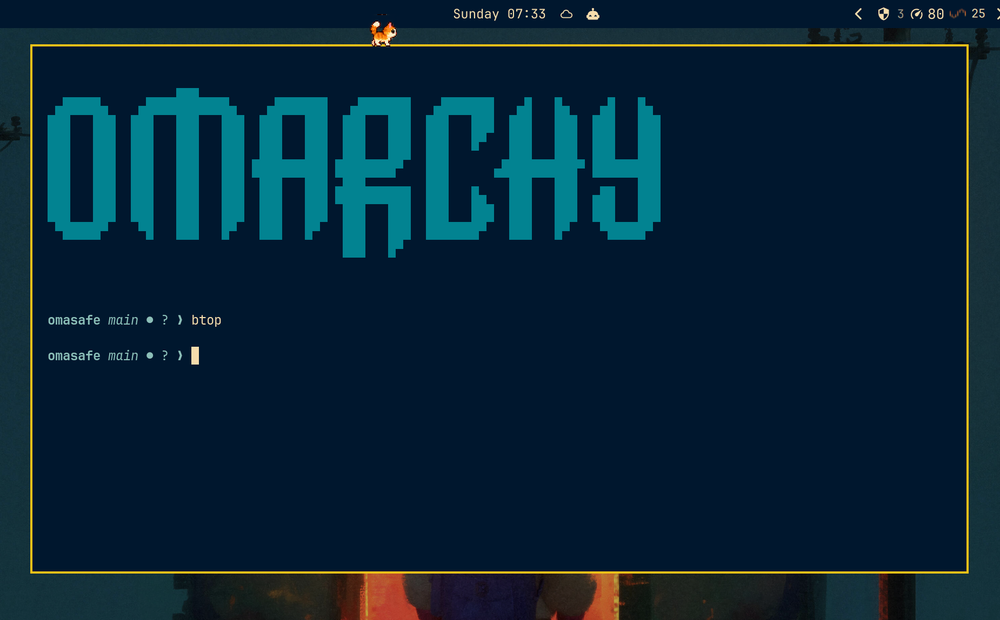

# Dropdown Terminal

An Omarchy Quickshell plugin that toggles the configured default terminal as a
floating overlay on the current Hyprland workspace.



## Install

From the plugin repository:

```bash
omarchy plugin add https://github.com/tuthan/omarchy-dropdown-terminal.git --enable
```

For local development:

```bash
plugin_dir="$HOME/.config/omarchy/plugins/io.github.tuthan.dropdown-terminal"
mkdir -p "$(dirname "$plugin_dir")"
if [ -L "$plugin_dir" ]; then unlink "$plugin_dir"; fi
mkdir -p "$plugin_dir"
rsync -a --delete --exclude='.git/' "$PWD"/ "$plugin_dir"/
omarchy-shell shell rescanPlugins
omarchy plugin enable io.github.tuthan.dropdown-terminal --section right
```

Omarchy expects a real plugin directory, so this setup copies the repository
into the plugin directory instead of symlinking it. The `.git` directory is
excluded because it is not needed by the runtime and may be protected by
Omarchy. After making source changes, rerun the `rsync` command and
`omarchy-shell shell rescanPlugins`.

The helper requires `jq`, `hyprctl`, and the Omarchy `omarchy` command.

## Update

For a plugin installed from GitHub, update it with:

```bash
omarchy plugin update io.github.tuthan.dropdown-terminal --yes
omarchy restart shell
```

For local development, recopy the repository into the real plugin directory
and rescan it:

```bash
rsync -a --delete --exclude='.git/' "$PWD"/ "$HOME/.config/omarchy/plugins/io.github.tuthan.dropdown-terminal"/
omarchy-shell shell rescanPlugins
```

## Hotkey

The plugin registers `io.github.tuthan.dropdown-terminal:toggle` with Hyprland. The easiest
persistent binding is one line in `~/.config/hypr/bindings.lua`:

```lua
hl.bind("CTRL + GRAVE", hl.dsp.global("io.github.tuthan.dropdown-terminal:toggle"))
```

This is deliberately the only Hyprland configuration required. The plugin
does not replace or hard-code the user's terminal emulator.

For a temporary test without editing a file, run:

```bash
hyprctl eval 'hl.bind("CTRL + GRAVE", hl.dsp.global("io.github.tuthan.dropdown-terminal:toggle"))'
```

The runtime version is lost when Hyprland reloads; use the `bindings.lua` line
for a persistent shortcut. To use a physical keycode instead of the keyboard
symbol, for example:

```lua
hl.bind("CTRL + code:41", hl.dsp.global("io.github.tuthan.dropdown-terminal:toggle"))
```

The bar icon also provides shortcuts: right-click it to add the default
`Ctrl + Grave` binding, or middle-click it to toggle auto-hide when the terminal
loses focus. If the binding is not already present, the plugin backs up
`bindings.lua`, appends the line, and reloads Hyprland.

## Configuration

The bar widget settings include `Show icon`. Turn it off to hide the icon while
keeping the global shortcut and terminal service active.

From a terminal, the same setting can be changed with:

```bash
# Hide the icon
omarchy bar set io.github.tuthan.dropdown-terminal showIcon false --json

# Show the icon again
omarchy bar set io.github.tuthan.dropdown-terminal showIcon true --json
```

The `--json` flag is required so `false` and `true` are stored as boolean
values rather than text. After changing this setting for the first time, restart
the shell to apply it:

```bash
omarchy restart shell
```

Auto-hide can also be changed from a terminal:

```bash
# Enable auto-hide on focus loss
omarchy bar set io.github.tuthan.dropdown-terminal autoHideOnFocusLoss true --json

# Disable it
omarchy bar set io.github.tuthan.dropdown-terminal autoHideOnFocusLoss false --json
```

The default auto-hide delay is 500 ms and can be adjusted from the widget
settings or with:

```bash
omarchy bar set io.github.tuthan.dropdown-terminal autoHideDelayMs 500 --json
```

Hiding moves the terminal to the hidden workspace, so it uses Hyprland’s
configured window-out animation.

## Behavior

- First activation runs `omarchy launch terminal`, preserving the configured
  default terminal and current working directory behavior.
- The new window stays on the current workspace, floats at 90% × 45%, and is
  centered near the top edge so the current desktop remains visible behind it.
- Later activations move the same terminal to/from a hidden workspace named
  `dropdown-terminal-hidden`, without changing the user's current workspace.
- Existing dropdown windows are detected after a shell restart, so they are
  reused instead of duplicated.
- Runtime state is stored in `XDG_RUNTIME_DIR` when it is private; if that is
  unavailable, the plugin creates a private per-user directory under `/tmp`.

## Remove

```bash
omarchy plugin remove io.github.tuthan.dropdown-terminal
```

## License

MIT
