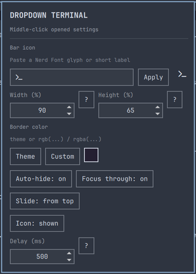

# Dropdown Terminal

An Omarchy Quickshell plugin for summoning the configured default terminal as a
fast, focused floating overlay on the current Hyprland workspace—with bounded
entrance effects, click-through pets, and optional privacy-preserving command
completion indicators.


## Video Demo

https://github.com/user-attachments/assets/f9a374ee-0e1f-4f67-b7dd-a44dcc4f5207

## What's new in 2.0

Version 2.0 focuses the plugin around a calmer, clearer control surface:

- The settings panel is split into `General` and `Animation & pets`, with native
  keyboard navigation and bounded scrolling.
- Entrance effects now include `Fire / burn`, `Firework`, `Thunder`, `Snow`, and
  `Rain`, alongside `Off` and `Glow`.
- The pet library includes the validated `Penguin`, `Fluffy cat`, and `Corgi`
  packs.
- Command tracking remains opt-in, explicit, and privacy-preserving: it records
  lifecycle metadata only, never command text or terminal output.

## Install

From the plugin repository:

```bash
omarchy plugin add https://github.com/tuthan/omarchy-dropdown-terminal.git --enable
```

For local development:

```bash
plugin_dir="$HOME/.config/omarchy/plugins/io.github.tuthan.dropdown-terminal"
mkdir -p "$(dirname "$plugin_dir")"
if [ -L "$plugin_dir" ]; then unlink "$plugin_dir"; fi
mkdir -p "$plugin_dir"
rsync -a --delete --exclude='.git/' "$PWD"/ "$plugin_dir"/
omarchy-shell shell rescanPlugins
omarchy plugin enable io.github.tuthan.dropdown-terminal --section right
```

Omarchy expects a real plugin directory, so this setup copies the repository
into the plugin directory instead of symlinking it. The `.git` directory is
excluded because it is not needed by the runtime and may be protected by
Omarchy. After making source changes, rerun the `rsync` command and
`omarchy-shell shell rescanPlugins`.

The helper requires `jq`, `hyprctl`, and the Omarchy `omarchy` command.
The optional pet-pack validator also requires ImageMagick's `identify` decoder
to verify PNG contents and manifest dimensions.

## Design and implementation rules

New work follows the reusable
[General Omarchy plugin design rules](../plugin-docs/rules/omarchy-plugin-design.md)
through this repository's [design-rule profile](docs/design-rules.md) and
[phase plan](docs/plan/README.md).

The profile makes truthful state, explicit/reversible external config edits,
native Omarchy UI tokens, theme ownership, bounded motion, reduced motion, and
input safety part of each phase's acceptance gate. Phase 0 closes the original
settings-reload, mutation-confirmation, and stacked-monitor parking gaps.

## Update

For a plugin installed from GitHub, update it with:

```bash
omarchy plugin update io.github.tuthan.dropdown-terminal --yes
omarchy restart shell
```

For local development, recopy the repository into the real plugin directory
and rescan it:

```bash
rsync -a --delete --exclude='.git/' "$PWD"/ "$HOME/.config/omarchy/plugins/io.github.tuthan.dropdown-terminal"/
omarchy-shell shell rescanPlugins
```

## Hotkey

The plugin registers `io.github.tuthan.dropdown-terminal:toggle` with Hyprland. The easiest
persistent binding is one line in `~/.config/hypr/bindings.lua`:

```lua
hl.bind("CTRL + GRAVE", hl.dsp.global("io.github.tuthan.dropdown-terminal:toggle"))
```

This is deliberately the only Hyprland configuration required. The plugin
does not replace or hard-code the user's terminal emulator.

For a temporary test without editing a file, run:

```bash
hyprctl eval 'hl.bind("CTRL + GRAVE", hl.dsp.global("io.github.tuthan.dropdown-terminal:toggle"))'
```

The runtime version is lost when Hyprland reloads; use the `bindings.lua` line
for a persistent shortcut. To use a physical keycode instead of the keyboard
symbol, for example:

```lua
hl.bind("CTRL + code:41", hl.dsp.global("io.github.tuthan.dropdown-terminal:toggle"))
```

The bar icon also provides shortcuts: left-click it to toggle the terminal,
middle-click it to open the settings panel, or right-click it to review the
default `Ctrl + Grave` binding. The cancel-first preflight names the exact
chord, target, effect, backup, and removal path, and lists any existing
`Ctrl + Grave` conflicts before offering an explicit “Add anyway” action; only
confirmation performs the atomic edit and Hyprland reload.

## Configuration

Middle-click the bar icon to open the settings panel:



The panel is organized into two tabs to keep related controls together:

- `General` contains terminal sizing and behavior, urgency, command tracking,
  and shell integration.
- `Animation & pets` contains entrance effects, intensity, pet selection and
  activity, plus reduced-motion controls.

Long effect lists stay inside the panel's scrollable content area, so the
settings card remains usable at smaller heights.

The bar widget settings include `Show icon`. Turn it off to hide the icon while
keeping the global shortcut and terminal service active.

The **Bar icon** setting accepts a Nerd Font glyph or short text and shows a
live preview in the settings panel. The default is the terminal glyph `\uF120`.

The **Entrance effect** setting controls the decorative finish shown after the
terminal settles into place. **Off** unloads the effect surface; **Glow** is
enabled by default. The other finite treatments are **Fire / burn**,
**Firework**, **Thunder**, **Snow**, and **Rain**. **Effect intensity** ranges
from 0 to 100 in steps of 10. Every effect is click-through, follows the
terminal's output and corner radius, and does not represent command success,
failure, or attention.

### Pets and reduced motion

The pet is disabled by default. Choose the **Penguin**, **Fluffy cat**, or
**Corgi** pack when enabling it. Each stays on the terminal edge and remains
click-through; **On focus** permits focus reactions, **Always visible** also
permits infrequent walking and sleep, and **Celebrations** limits it to
qualifying precise command results from the explicit shell integration.
Generic urgency never produces a success or failure pet reaction.

**Reduce motion** holds the pet on a static pose, suppresses entrance particles,
and changes the Phase 2 bar indicator to a colored dot. It is plugin-local
because this host does not expose a reliable Omarchy-wide reduced-motion
preference.

### Command completion indicator

The bar icon can show four semantic states: `running`, generic `attention`,
`succeeded`, and `failed`. The generic attention state uses the managed
terminal's Hyprland urgency flag and requires no shell changes; it means only
that the terminal needs attention, not that a command succeeded or failed.

For precise completion status, enable **Command tracking** in the settings
panel. Enabling the preference does not edit a shell startup file. It reveals
an explicit, cancel-first **Install shell integration** action for the current
login shell (Bash, Zsh, or Fish). The confirmation names the exact rc file and
guarded source block, creates a timestamped `cp -p` backup before an atomic
replacement, and the helper verifies the exact block after the edit. The
matching remove action deletes only that marked block.

The hooks append one short, newline-terminated record per event to the private
per-login journal at:

```text
$XDG_RUNTIME_DIR/io.github.tuthan.dropdown-terminal.events
```

They use shell builtins on the prompt path and never store command text,
terminal output, or prompt output. Commands shorter than the configurable
**Command notify threshold** (5 seconds by default) do not notify. Exit status
130 is ignored by default; **Treat Ctrl-C as failure** changes that policy.
Foreground commands only are tracked: a command sent to the background is
complete from the prompt's point of view, while true job-control notifications
are outside this phase.

The helper exports the journal path and a per-launch session token only to the
terminal it starts. If a terminal server discards per-launch environment, its
precise command tracking is unsupported; the generic urgency indicator remains
available. Showing or focusing the dropdown clears unread completion state.

From a terminal, the same setting can be changed with:

```bash
# Hide the icon
omarchy bar set io.github.tuthan.dropdown-terminal showIcon false --json

# Show the icon again
omarchy bar set io.github.tuthan.dropdown-terminal showIcon true --json
```

The `--json` flag is required so `false` and `true` are stored as boolean
values rather than text. After changing this setting for the first time, restart
the shell to apply it:

```bash
omarchy restart shell
```

Auto-hide can also be changed from a terminal:

```bash
# Enable auto-hide on focus loss
omarchy bar set io.github.tuthan.dropdown-terminal autoHideOnFocusLoss true --json

# Disable it
omarchy bar set io.github.tuthan.dropdown-terminal autoHideOnFocusLoss false --json
```

The default auto-hide delay is 500 ms and can be adjusted from the widget
settings or with:

```bash
omarchy bar set io.github.tuthan.dropdown-terminal autoHideDelayMs 500 --json
```

### Focus through the dropdown

The settings panel also offers **Focus through**. When enabled, it adds this
plugin-managed override to `~/.config/hypr/input.lua` and reloads Hyprland:

```lua
hl.config({
  input = {
    special_fallthrough = true,
  },
})
```

This lets normal windows receive pointer focus while the floating special
workspace is visible, making auto-hide work naturally with focus-follows-mouse.
The option affects all floating special workspaces and removes only its own
marked override when disabled.

The terminal size and border can also be adjusted from the widget settings:

```bash
omarchy bar set io.github.tuthan.dropdown-terminal widthPercent 90 --json
omarchy bar set io.github.tuthan.dropdown-terminal heightPercent 45 --json
omarchy bar set io.github.tuthan.dropdown-terminal borderColor 'rgb(ff8800)' --json
```

### Slide direction

Hyprland's `slidevert` special-workspace animation always reveals upward, and
its animation styles take no direction argument, so a special workspace cannot
be told to drop downward. **Slide down from top** (on by default) works around
this: the terminal is parked above the top edge as the workspace is revealed and
then animated down into place, so it drops in like a Quake console.

```bash
# Use Hyprland's native (upward) special-workspace animation instead
omarchy bar set io.github.tuthan.dropdown-terminal slideFromTop false --json
```

While a summon is in flight the plugin temporarily overrides the global
`specialWorkspace` animation node to an imperceptible speed and restores it
immediately afterwards, including if it is interrupted. The child
`specialWorkspaceIn` / `specialWorkspaceOut` nodes are never touched: they
resolve their duration through the parent, so suppressing the reveal does not
turn them into explicit overrides. Suppression requires the `specialWorkspace`
node to be explicitly configured (every Omarchy install sets it in
`looknfeel.lua`); if it only inherits defaults, the native reveal is used
instead, because the runtime API cannot restore inheritance once a node has
been written. This is a runtime override only: nothing is written to your
Hyprland config, and any `hyprctl reload` clears it. The suppression lasts a
few hundred milliseconds and is shared with other special workspaces such as
Omarchy's `SUPER + S` scratchpad, which is near-instant for that brief window.
Concurrent invocations of the helper are serialized with a lockfile.

The default border color is `theme`, which leaves the border under Omarchy and
Hyprland theme control. Use a Hyprland `rgb(...)` or `rgba(...)` value for a
custom border. Size and custom border settings are reapplied the next time the
terminal is toggled.

Hiding slides the terminal up past the top edge and then toggles its named
Hyprland special workspace away. With **Slide down from top** turned off, the
workspace is toggled directly and Omarchy's configured special-workspace
animation is used instead.

## Behavior

- First activation runs `omarchy launch terminal`, preserving the configured
  default terminal and current working directory behavior.
- The new window stays on the current workspace, floats at the configured size
  (90% × 45% by default), and is
  centered near the top edge so the current desktop remains visible behind it.
- Later activations toggle the same terminal in the named special workspace
  `special:dropdown-terminal`, without changing the user's current workspace.
- With multiple monitors, summoning while the terminal is visible on another
  screen moves it to the focused screen instead, resized and positioned for
  that screen's dimensions and scale.
- Summoning parks the window above the focused monitor's top edge in the same
  synchronous compositor call as the reveal. Hyprland re-centers a floating
  window whenever its special workspace is revealed, and rejects any position
  whose center falls outside the monitor, so the park cannot be done ahead of
  time. Geometry is anchored to the relevant monitor's global origin, and the
  on-screen check uses the window's owner monitor so a vertically stacked
  neighbour cannot misclassify a parked rectangle.
- Existing dropdown windows are detected after a shell restart, so they are
  reused instead of duplicated.
- Runtime state is stored in `XDG_RUNTIME_DIR` when it is private; if that is
  unavailable, the plugin creates a private per-user directory under `/tmp`.

## Remove

```bash
omarchy plugin remove io.github.tuthan.dropdown-terminal
```

## License

MIT
